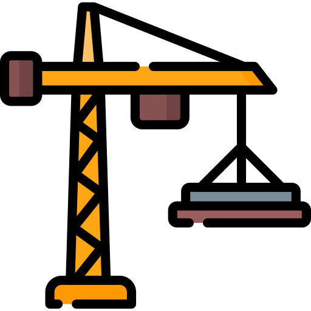

# Data Warehouse and Analytics Project

Welcome to the **Data Warehouse and Analytics Project** repository! 

This project demonstrates a comprehensive data warehousing and analytics solution, from building a data warehouse to generating actionable insights.  Designed as a portfolio project that highlights industry best practices in data engineeringand analytics.

-------------------------------------------------------------------------------------

##   Data Architecture

The Data architecture for this project follows Medallion Architecture **Bronze**, **Silver**, and **Gold** layers:

1. **Bronze Layer** : Stores raw data as-is from the source systems. Data is ingested from CSV Files into SQL Server Database.
2. **Silver Layer** : This layer includes data cleansing, standardization, and normalization processes to prepare data for analysis.
3. **Gold Layer** : Houses business-ready data modeled into a star schema required for reporting and analytics.##   	Project Requirements

---------------------------------------------------------------------------------------
## Project Overview

This project involves:

1. **Data Architecture**: Designing a Modern Data Warehouse Using Medallion Architecture Bronze, Silver, and Gold layers.
2. **ETL Pipelines**: Extracting, transforming, and loading data from source systems into the warehouse.
3. **Data Modeling**: Developing fact and dimension tables optimized for analytical queries.
4. **Analytics & Reporting**: Creating SQL-based reports and dashboards for actionable insights.

This repository is an excellent resource for professionals and students looking to showcase expertise in:

- SQL Development
- Data Architect
- Data Engineering
- ETL Pipeline Developer
- Data Modeling
- Data Analytics
---------------------------------------------------------------------------------------
## Important Links & Tools:

Everything is for Accessible from the following links:

- [Datasets](datasets): Access to the project dataset (csv files).
- MySQL Community Server: Lightweight server for hosting your SQL database.
- MySQL Workbench: GUI for managing and interacting with database.
- Git Repository: Set up a GitHub account and repository to manage, version, and collaborate on your code efficiently.
- DrawIO: Design data architecture, models, flows, and diagrams.
- Notion: Get the Project Template from Notion
- Notion Project Steps: Access to All Project Phases and Tasks.

----------------------------------------------------------------------------------------

### Building the Data Warehouse (Data Engineering)

#### Objective
Develop a modern data warehouse using SQL Server to consolidate sales data, enabling analytical reporting and informed decision-making.

#### Specifications
- **Data Sources**: Import data from two source systems (ERP and CRM) provided as CSV files.
- **Data Quality**: Cleanse and resolve data quality issues prior to analysis.
- **Integration**: Combine both sources into a single, user-friendly data model designed for analytical queries.
- **Scope**: Focus on the latest dataset only; historization of data is not required.
- **Documentation**: Provide clear documentation of the data model to support both business stakeholders and analytics teams.

---

### BI: Analytics & Reporting (Data Analysis)

#### Objective
Develop SQL-based analytics to deliver detailed insights into:
- **Customer Behavior**
- **Product Performance**
- **Sales Trends**

These insights empower stakeholders with key business metrics, enabling strategic decision-making.

---

## License

This project is not licensed. The code is not to be used, modified, nor shared with attribution.

## About Me

Hi there! I'm **Samuel J. Claxton**, a SQL Developer with vast years of hands-on experience designing, optimizing, and supporting SQL Server and Oracle databases for enterprise and federal systems. Proven expertise in complex query development, stored procedures, ETL validation, data migration, and performance tuning for high-volume transactional and reporting environments. Strong background in database schema design, execution plan analysis, and data quality enforcement within Agile teams. Oracle Certified Associate with advanced degrees in Information Technology and Business Administration.

For more details, refer to docs/requirements.md.
